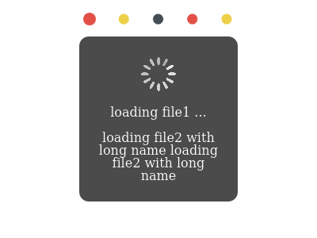
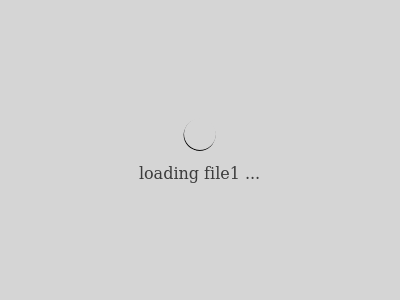

# react-loading-signal

[](https://www.npmjs.org/package/react-loading-signal)
[](https://travis-ci.org/roneyrao/react-loading-signal)
[](https://codecov.io/gh/roneyrao/react-loading-signal)
[](https://raw.githubusercontent.com/roneyrao/react-loading-signal/master/LICENSE)

A React loading indicator displayed globally or locally or both, which interoperate with each other.

[Online Demo >>](http://roneyrao.github.io/react-loading-signal)





## Features

-   Configurate global loading signal once for all (usually in ajax layer), and add any local loading signals anywhere, which could intercept global one, or not based on your needs.

-   Simple extendability to supply custom themes.

-   Support React 15.

## Install

```
npm install react-loading-signal
```

## Import

Take `GlobalLoading`as example

### es module
```
import { GlobalLoading } from 'react-loading-signal';
```

#### commonjs module
```
const GlobalLoading = require('react-loading-signal').GlobalLoading;
```

#### bundled version
```
import { GlobalLoading } from 'react-loading-signal/bundle';
```

or

```
const GlobalLoading = require('react-loading-signal/bundle').GlobalLoading;
```

or in global scope:

```
const GlobalLoading = LoadingSignal.GlobalLoading;
```

#### bundled minified version

Substitute 'bundle' with 'bundle.min'.

## Usage
```
// ajax layer
import { GlobalLoading, LocalLoading } from 'react-loading-signal';
const gLoading = new GlobalLoading();

// to change the global loading signal style, create a new one:
// new GlobalLoading(theme, true, true);

function request(url) {
  const idLoading = gLoading.open();

  // pass idLoading to LocalLoading, take redux for example:
  // dispatch({ type: url, loading: idLoading })

  fetch(url)
    .then(function(response) {
      return response.json();
    }, () => {})
    .then(function() {
      gLoading.close(idLoading);
    });
}

// local loading signal
<LocalLoading active={idLoading} />

```

## Themes

### Builtin themes

-   Spinning
-   Blobs
-   Circling
-   Progress

```
import { Themes } from 'react-loading-signal';
const { Spinning, Blobs, Circling, Progress } = Themes;
```

### Customize theme

Any valid React Component can be used as a theme. It will receive any props that's passed to `LocalLoading`.

## Styles

In bundled version, Classes are all prepended with `LoadingSignal__`. Details please refer to `/styles/LoadingSignal.css`. (`src/styles/LoadingSignal.css` in source code.)

## API

<!-- Generated by documentation.js. Update this documentation by updating the source code. -->

#### Table of Contents

-   [GlobalLoading](#globalloading)
    -   [open](#open)
    -   [close](#close)
    -   [getInstance](#getinstance)

### GlobalLoading

This class is singleton internally, But could be created more than once.
Exactly that is the only correct way to change the global loading signal styles on the fly.

**Parameters**

-   `theme` **React.ComponentType&lt;any>** Customized theme. (optional, default `Spinning`)
-   `masked` **bool** Whether to display overlay below. (optional, default `false`)
-   `closable` **bool** Whether the signal can be closed by clicking the mask. (optional, default `false`)

#### open

Open global loading signal

**Parameters**

-   `msg` **React.Node?** Message to show. (React.Node: anything React can render.)

Returns **Indicator** An identifier for this signal, ignoring its internal structure.

#### close

Close a signal

**Parameters**

-   `idLoading` **Indicator** The identifier returned by open().

Returns **void**

#### getInstance

**[static]**
Retrieve the GlobalLoading singleton instance.

Returns **instance**


## Exported flow types

### GlobalLoading & LocalLoading

-   `Indicator` **opaque** - What `GlobalLoaing.open()` returns, it's accepted by `GlobalLoaing.close()` and `LoadingProps.active`.

-   `Active` **Indicator | bool**  - The type of `LoadingProps.active`.

-   `LoadingProps`  - Props of `LocalLoading`

    -   `active` **Active** - Flag its visibility. When `Indicator` is passed, the global one will not shown. Pass `true` to leave global alone.
    -   `masked` **boolean** - Flag its mask visibility. (optional, default `false`)
    -   `message` **Node** - Content to display. (optional, default `undefined`)
    -   `button` **HTMLElement** - Button to be disabled, both a property and a class named `disabled` are set. (optional, default `false`)
    -   `container` **HTMLElement | false** - Container where its placed. When not provided, parentNode is implied. If set to `false`, no signal will be shown, other functions still work. (optional, default `undefined`)
    -   `theme` **React.ComponentType&lt;\*>** - The Component defining its actual visual outlook. You can pass any props to `LocalLoading` which will be relayed to this component. (optional, default `Blobs`)

```
import { type Indicator, type Active, type LoadingProps } from 'react-loading-signal';
```

### Progress Theme

-   `Caption` **(number) => string** Handler to generate progressing caption string.
-   `ProgressProps` Props of `Progress` Component.

    -   message **number** The decimal number indicating current progress. The max is 1.
    -   caption **Caption** see above.

```
import { Themes } from 'react-loading-signal';
const { Progress } = Themes;
const Props: Themes.ProgressProps = {...};
// or
import { Progress, ProgressProps } from 'react-loading-signal/themes';
// or
import { Progress, type ProgressProps } from 'react-loading-signal/themes/progress';
```

## Development

-   To test when developing, run the demo:
```
npm start
```

-   E2e tests are run against [PhantomJS v2.1.1](http://phantomjs.org/), if you adopt other versions or tools, the snapshots shipped maybe invalidated, run this command to update:

```
npm run test:e2e--updateSnapshots
```

## License

[MIT](LICENSE).
